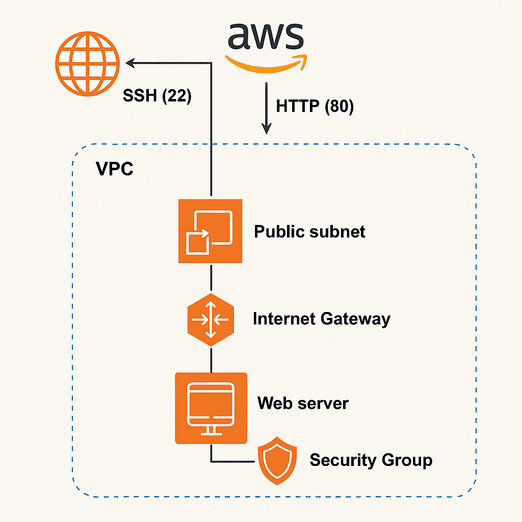

### Terraform AWS Web Server Deploy

* Deploying a complete AWS Web Server in AWS through Terraform. 

#### Architecture

#### Components we are going to build

1. Virtual Private Cloud
2. Internet Gateway
3. Security Group

#### Steps 
1. Setup the Environment
2. Initilize the provider
3. Create VPC
4. Add a public subnet
5. Add a internet Gateway and Route Table
6. Create security group
7. Launch EC2 instance
8. Access the Website
9. Destroy 

**NOTE: Do the above project in AWS Console manually for better understanding of how things work.** 